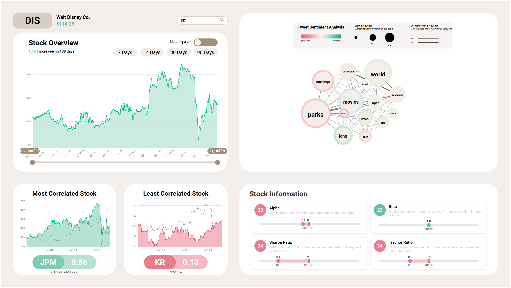

# Stock Market Dashboard

## 📈 Project Overview

This interactive D3.js-based dashboard visualizes popular US stocks listed in the S&P 500. It integrates historical price data with social media sentiments, providing users with insights through sentiment analysis, stock correlation analysis, and performance metrics. 

Our goal is to make financial insights accessible to everyone, especially those without extensive trading experience, through easy-to-interpret visuals and clear descriptions.



## ✨ Features

### 📊 Main Control Section
- **Stock Selection**: Search bar with auto-suggestions for S&P 500 stocks
- **Stock Summary**: Displays stock full name and last price information

### 📉 Main Line Chart
- **Historical Price Trends**: Interactive visualization of stock price history
- **Moving Averages**: Toggle switch for 7, 14, 30, and 90-day moving averages
- **Range Selector**: Interactive slider to select custom date ranges for analysis

### 🔍 Sentiment Analysis
- **Real-time Processing**: Keywords extracted from tweets are processed on-demand
- **Sentiment Visualization**: Interactive bubble chart showing:
  - Keyword sentiment scores
  - Frequency of mentions
  - Relationships between keywords
- **Interactive Elements**: Users can drag bubbles to customize their view

### 🔄 Correlation Chart
- **Stock Correlations**: Displays the most and least correlated stocks to your selection
- **Comparative Analysis**: Selected stock's graph is overlaid for easy comparison

### 📋 Performance Table
- **Key Metrics**: Shows important performance indicators including:
  - Alpha and Beta values
  - Sharpe and Treynor ratios
- **Market Comparison**: Compares metrics against the S&P 500 benchmark
- **Visual Indicators**: Uses charts to show relative performance

## 🛠️ Technology Stack

### Frontend
- **D3.js**: For data visualization components
- **HTML/CSS/JavaScript**: Core web technologies
- **Interactive Elements**: Custom-built sliders, toggles, and draggable components

### Backend
- **FastAPI**: Python-based API server for data processing
- **Pandas/NumPy**: For financial calculations and data manipulation
- **Sentiment Analysis**: Natural language processing for social media data

## 📥 Installation

### Option 1: Run Locally
1. Clone the repository:
   ```bash
   git clone https://github.com/gderiddershanghai/dva_team173_frontend.git
   ```
2. Set up a Python virtual environment (Python 3.8+ recommended):
   ```bash
   python -m venv venv
   source venv/bin/activate  # On Windows: venv\Scripts\activate
   ```
3. Install required packages:
   ```bash
   pip install -r requirements.txt
   ```

### Option 2: Use the Live Demo
Visit our hosted version at [https://gderiddershanghai.github.io/dva_team173_frontend/](https://gderiddershanghai.github.io/dva_team173_frontend/)

*Note: The cloud-hosted version may be slower than running locally due to resource limitations.*

## 🚀 Usage

1. Start the backend server:
   ```bash
   python calculations/calculation_api.py
   ```

2. Launch a local server for the frontend:
   - Using VS Code: Install the "Live Server" extension, right-click on `index.html` and select "Open with Live Server"
   - Using Python: `python -m http.server` in the project directory
   - Using Node.js: `npx serve` in the project directory

3. Open your browser and navigate to the local server address (typically http://localhost:5500 or http://localhost:8000)

## 📊 Data Sources

- **Stock Price Data**: Historical price data for 40 major S&P 500 stocks
- **Social Media Data**: Processed Twitter data with sentiment analysis
- **Market Benchmark**: S&P 500 index (SPY) for performance comparisons

## 👥 Team Members

- Ginger Armando de Ridder
- Jason Othniel Lim
- Wooseok Kim
- Carina Lim
- Gwan-Hyeong Song